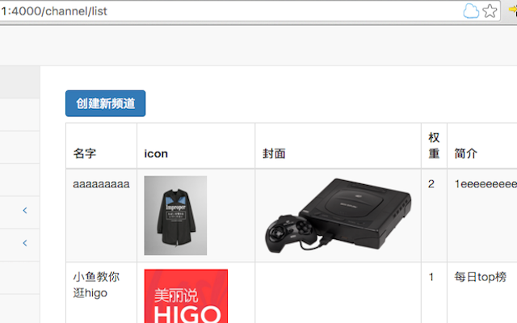
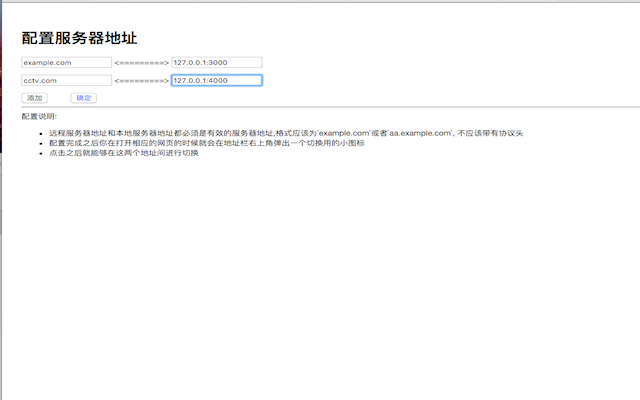

# HostSwitcher

通过Chrome插件来切换URL中的HOST，方便程序员在本地重现bug。

比如

- 线上服务器的地址是`online.com`
- 线下服务器的地址是`offline.com`

那么这时候如果我们有一个URL为`oneline.com/x/y/z`，那么我们就能通过这个扩展轻松地切换到本地的服务器地址`offline.com/x/y/z`

## 如何使用

1. 在应用安装好之后,打开插件的设置界面(~~一般来说他会自动弹出设置界面~~),在里面配置好你的服务器域名和本地域名.域名后面允许加端口号.
2. 然后你在浏览对应的网页的时候地址栏上会出现一个云朵的按钮.点一下就会进行域名的切换了.

## 截图

## 下载地址

- [Chrome商店](https://chrome.google.com/webstore/detail/%E5%9F%9F%E5%90%8D%E5%88%87%E6%8D%A2%E5%99%A8/lodhoameeheeedebkghhlmifhinfkhhe)

## License

MIT

## 写在最后

不要问我为什么icon这么好看,我不会告诉你是我握着鼠标画出来的.